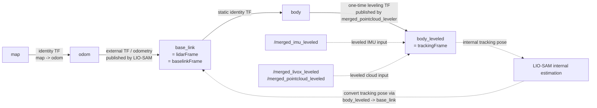

# LIO-SAM 与 body_leveled / map 水平语义改造记录（2026-04-08）

## 1. 背景与目标

这次改造主要解决三个相互关联的问题：

- `/merged_pointcloud_leveled` 已经完成一次性水平化，但在整链路运行时，看起来仍然像“没水平”。
- 直接把 LIO-SAM 的世界系改名为 `map_leveled` 之后，RViz 视觉上似乎更接近预期，但 TF/里程计语义并不自洽，还出现过位姿跳变。
- rosbag 回放启动时，`merged_pointcloud_leveler` 标定窗口过长或过严，导致 LIO-SAM 很久拿不到稳定输入，表现为“放 bag 20s 才开始跑”。

本次目标不是继续做“名字层面”的修补，而是让以下语义真正成立：

- 传感器侧输入点云和 IMU 经过一次性重力对齐后，形成 `body_leveled` 语义。
- LIO-SAM 内部跟踪真的工作在这套水平语义上。
- 对外暴露给系统其余节点的 `odom / map / base_link` 语义保持稳定，避免打坏现有 TF 树和下游模块。

## 2. 先前问题的根因

### 2.1 “看起来没水平”不等于点云没有被水平化

实际排查中已经确认：

- `/merged_pointcloud_leveled` 的 `header.frame_id` 是 `body_leveled`。
- `merged_pointcloud_leveler` 会发布 `body -> body_leveled` 的旋转变换。
- 也就是说，点云本身已经被旋转到了重力对齐后的坐标系中。

之所以在 RViz 中仍然像“没水平”，核心原因不是点云没转，而是可视化时所选固定参考系与传感器侧水平系不是一回事。换句话说，显示错位来自“世界系语义不一致”，不是来自点云没做 leveling。

### 2.2 仅把世界系改名为 `map_leveled` 是错误路径

之前尝试过把：

- `lio_sam/odometryFrame`
- `lio_sam/mapFrame`
- `system_bringup` / `M-detector` / RViz 配置中的世界系参数

向 `map_leveled` 方向改名。

这个办法的问题在于：

- 它没有真正发布一个“经过水平化后的世界系变换”。
- 它只是改了名字，没有改变 LIO-SAM 内部实际进行 deskew、预积分和建图时依附的姿态语义。
- 这样会造成“名字像是 leveled 了，但数值链路没有真的 leveled”，最终出现 pose jump、显示误导和下游理解混乱。

结论是：不能用简单重命名来伪造水平世界系。

### 2.3 不能直接把 `lidarFrame` / `baselinkFrame` 改成 `body_leveled`

这也是一个高风险误区。

原因是一次性 leveler 已经发布了：

```text
body -> body_leveled
```

如果再让 LIO-SAM 对外发布：

```text
odom -> body_leveled
```

那么 `body_leveled` 会同时拥有两个父节点，TF 树会冲突。也就是说：

- `body_leveled` 可以是内部 tracking frame。
- 但不应该直接变成 LIO-SAM 对外的 `lidarFrame` 或 `baselinkFrame`。

## 3. 最终采用的稳定方案

最终方案是把“内部跟踪语义”和“对外发布语义”明确拆开。

### 3.1 核心思路

- `lidarFrame` 继续保持为 `base_link`
- `baselinkFrame` 继续保持为 `base_link`
- `odometryFrame` 保持 `odom`
- `mapFrame` 保持 `map`
- 新增 `trackingFrame`，并设置为 `body_leveled`

这样系统被拆成两层：

1. 传感器输入与 LIO-SAM 内部估计层：使用 `body_leveled` 这套水平语义。
2. 系统外部接口层：仍然对外输出 `odom -> base_link`、`map -> odom`、路径和里程计等常规语义。

### 3.2 这套方案的本质

这不是“把 frame 换个名字”，而是：

- LIO-SAM 内部的 tracking pose 真的定义在 `body_leveled` 上。
- 对外发布 odometry、TF、path 时，再把 tracking pose 转回到 `lidarFrame/base_link`。

因此现在 `map` 与 `body_leveled` 的关系不再是伪装出来的，而是通过内部 tracking 数值链路真正建立起来的。

## 4. TF 与数据流的语义拆分

### 4.1 传感器与水平化层

`merged_pointcloud_leveler` 的职责：

- 读取 `/merged_imu`
- 读取 `/merged_pointcloud`
- 读取 `/merged_livox`
- 计算一次性水平化旋转
- 发布：
  - `/merged_imu_leveled`
  - `/merged_pointcloud_leveled`
  - `/merged_livox_leveled`
  - `body -> body_leveled`

可以理解为：它负责把传感器原始 body 坐标系，转换成重力对齐后的 `body_leveled`。

### 4.2 LIO-SAM 内部层

LIO-SAM 现在读取：

- `pointCloudTopic: /merged_livox_leveled`
- `imuTopic: /merged_imu_leveled`
- `trackingFrame: body_leveled`

因此：

- `imageProjection` 输出的 deskewed cloud 已经带 `body_leveled` frame。
- `imuPreintegration` 的内部增量推算基于 tracking frame。
- `mapOptimization` 维护的 `transformTobeMapped` 也代表 tracking frame 在 odom 中的位姿。

### 4.3 对外发布层

对外时不直接发布 `odom -> body_leveled`，而是借助：

```text
trackingFrame -> lidarFrame
```

把 tracking pose 转换成 lidar/base pose，再发布：

- 全局 odometry
- `odom -> base_link` TF
- path

这一步保证：

- LIO-SAM 的内部世界真的是 leveled 的。
- 外部世界接口又仍然兼容原有系统。

### 4.4 TF 与数据流关系示意图

下面这张图把本次改造后最关键的 frame 关系和数据流关系放在一起了。



这张图的读法如下：

- 实线表示当前系统中真正存在的 TF 关系或对外发布关系。
- 虚线表示数据流或内部语义依附关系，不代表额外新增了一条 TF。
- `map -> odom` 仍保持恒等语义，系统级世界参考仍是原来的 `map/odom` 组合。
- `odom -> base_link` 仍是 LIO-SAM 对外发布给系统其余模块消费的主位姿关系。
- `base_link -> body` 当前由静态 TF 显式声明为重合关系，用于衔接原始 Livox 输出 frame。
- `body -> body_leveled` 由 `merged_pointcloud_leveler` 在一次性标定完成后发布，负责把传感器坐标系转到重力对齐后的水平语义。
- `body_leveled` 是 LIO-SAM 的内部 `trackingFrame`，因此内部 deskew、预积分和建图围绕它展开。
- LIO-SAM 完成内部估计后，会利用 `body_leveled -> base_link` 的已有 TF，把内部 tracking pose 再转换成外部 base pose，然后对外发布 odometry、TF 和 path。

如果只看 TF 树，可以把它简化为：

```text
map -> odom -> base_link -> body -> body_leveled
```

但要特别注意，这个线性串联只描述“可查询到的 frame 关系”；真正的工程关键点在于：

- 内部 tracking 语义停在 `body_leveled`
- 外部发布语义回到 `base_link`

也正是这个“内部 leveled、外部兼容”的拆分，解决了之前仅改 frame 名称时的语义不一致问题。

## 5. 代码改动明细

### 5.1 `src/LIO-SAM-MID360/include/utility.h`

新增：

- `string trackingFrame;`

参数加载逻辑：

- 读取 `lio_sam/trackingFrame`
- 若未配置，则回退到 `lidarFrame`

作用：

- 给 LIO-SAM 引入“内部 tracking frame”这一层概念。
- 不影响旧配置；旧工程若不配该参数，会继续沿用原本 `lidarFrame` 语义。

### 5.2 `src/LIO-SAM-MID360/config/paramsLivoxIMU.yaml`

当前关键配置为：

```yaml
lidarFrame: "base_link"
baselinkFrame: "base_link"
trackingFrame: "body_leveled"
odometryFrame: "odom"
mapFrame: "map"
```

这几行定义了最终稳定语义：

- 外部仍是 `base_link`
- 内部 tracking 切到 `body_leveled`
- 世界系回到稳定的 `odom/map`

### 5.3 `src/LIO-SAM-MID360/src/imageProjection.cpp`

关键改动：

- `cloudInfo.cloud_deskewed` 不再以 `lidarFrame` 发布
- 改为以 `trackingFrame` 发布

作用：

- 后面的 `cloud_info` 与 mapOptimization 能够直接知道“当前 deskew 结果属于哪个 tracking frame”。
- 这使得后续优化链路在语义上真正转到了 `body_leveled`。

### 5.4 `src/LIO-SAM-MID360/src/imuPreintegration.cpp`

新增能力：

- 缓存 `trackingFrame -> lidarFrame` 变换
- 在 IMU 增量 odom 与激光 odom 融合时，将 tracking pose 转换为 lidar pose

具体表现为：

- 内部使用 tracking frame 做增量推算
- 对外发布给 ROS 的 IMU odometry，`child_frame_id` 仍回到 `lidarFrame`

这样做的意义是：

- 不破坏下游默认认知，即“LIO-SAM 对外还是在给 base_link/lidar 的位姿”。
- 同时保留内部基于水平语义工作的好处。

### 5.5 `src/LIO-SAM-MID360/src/mapOptmization.cpp`

这是这次改造最关键的文件之一。

新增/调整的能力包括：

- 记录当前生效的 tracking frame
- 查询并缓存 `trackingFrame -> lidarFrame` 变换
- 把 tracking pose 转换为 lidar pose
- 在 `publishOdometry()` 中同时区分：
  - tracking 语义的内部 odometry
  - lidar/base 语义的对外 odometry
- 在 `updatePath()` 中，将 path 中的 pose 也转换到对外语义后再发布

结果是：

- 地图优化本身围绕 `body_leveled` tracking pose 展开
- 但 RViz 和其他外部节点拿到的仍是 `odom -> base_link` 这类熟悉语义

### 5.6 `src/Livox_merge/src/merged_pointcloud_leveler_node.cpp`

为了解决 bag 回放时“标定太慢、启动太晚”的问题，对一次性水平化节点做了静止样本门控增强。

新增参数：

- `calib_max_gyro_norm_rad_s`
- `calib_acc_norm_tolerance_ratio`
- `calib_acc_norm_gate_warmup_samples`

新增策略：

- 当角速度过大时，拒绝该 IMU 样本进入标定均值。
- 当加速度模长偏离当前均值过大时，拒绝该 IMU 样本。
- 支持 warmup 样本数，避免过早使用不稳定均值做门控。

效果：

- 启动时轻微晃动不再显著拉长标定时间。
- 也降低了“用不静止样本算平均重力方向”导致结果偏掉的风险。

### 5.7 `src/Livox_merge/launch/merged_pointcloud_leveler.launch`

共享 launch 默认值被收敛为较稳的基线：

```xml
calib_duration_sec = 2.0
min_imu_samples = 800
calib_max_gyro_norm_rad_s = 0.2
calib_acc_norm_tolerance_ratio = 0.15
calib_acc_norm_gate_warmup_samples = 50
```

这组值更适合默认场景，强调标定质量与稳定性。

### 5.8 `src/system_bringup/launch/run_dynamic_detector.launch`

为了照顾 rosbag 回放场景，主回放 launch 显式覆盖为更快进入工作状态的参数：

```xml
leveler_calib_duration_sec = 1.0
leveler_min_imu_samples = 200
leveler_calib_max_gyro_norm_rad_s = 0.5
```

同时保留：

- `odometry_frame = odom`
- `world_frame = map`

说明现在系统策略是：

- 传感器侧仍使用 `body_leveled`
- 世界侧保持原有 `odom/map`
- 不再引入伪 `map_leveled`

### 5.9 `src/system_bringup/launch/run_cylinder_warning.launch`

同样加入 rosbag 回放友好的 leveler 覆盖参数，并保持：

- `odometry_frame = odom`
- `world_frame = map`

这样告警链路与动态检测链路不会因为世界系命名实验而分叉。

## 6. 为什么这套方案比直接改 frame 名称更稳

### 6.1 它满足 TF 树约束

这套方案没有让 `body_leveled` 成为两个父节点下的子节点，因此不会引入双父冲突。

### 6.2 它满足内部数值链路一致性

LIO-SAM 的 deskew、预积分、scan-to-map 优化、路径累积，现在都围绕同一个 tracking 语义进行，而不是“输入是 leveled 的，输出却假装还是旧语义”。

### 6.3 它满足对外兼容性

下游模块依赖的大多数仍是：

- `map`
- `odom`
- `base_link`

保持这些对外接口不乱，比把整个系统一起迁移到 `body_leveled` 风险小得多。

## 7. 当前验证结果

### 7.1 代码构建验证

已执行：

```bash
cd /home/nvidia/ws_livox
catkin_make --pkg lio_sam -j1
```

结果：

- 编译通过
- 关键目标成功构建：
  - `lio_sam_imageProjection`
  - `lio_sam_mapOptmization`
  - `lio_sam_imuPreintegration`

### 7.2 launch 解析验证

已执行：

```bash
source devel/setup.bash && roslaunch --nodes system_bringup run_dynamic_detector.launch
```

结果：

- 启动图解析通过
- 关键节点均在图中出现，包括：
  - `merged_pointcloud_leveler`
  - `lio_sam_imuPreintegration`
  - `lio_sam_imageProjection`
  - `lio_sam_mapOptmization`
  - `dynamic_tracker`

### 7.3 运行观察

运行过：

```bash
roslaunch system_bringup run_cylinder_warning.launch
```

当前观察结论是：

- 现象上已经基本符合预期，说明“内部 tracking 使用 body_leveled、对外保持 base_link 语义”的方向是对的。
- 之前那种“点云明明 leveled 了，但在世界里看起来还是歪的”的问题，已经被这套语义拆分方案显著缓解。

## 8. 目前仍需注意的点

虽然主问题已经解决，但还有两个点值得继续关注。

### 8.1 下游是否假定 incremental odometry 的 child frame 固定不变

当前实现中：

- 全局对外 odometry 已转换为 `lidarFrame`
- 但某些内部/增量 odometry 仍可能保留 tracking 语义

如果下游节点硬编码假定某个 topic 的 `child_frame_id` 必定是 `base_link`，则仍需要继续核查。

### 8.2 RViz 里“验证传感器是否被水平化”和“验证地图/轨迹是否稳定”应区分参考系

建议：

- 验证传感器侧 leveling 是否正确时，优先用 `body_leveled` 作为固定参考。
- 验证系统级轨迹/地图行为时，使用 `map` 作为固定参考。

这两个观察目标不同，混在一起很容易再次造成“明明代码对了，但视觉直觉不对”的误判。

## 9. 结论

本次改造的核心不是简单重命名 frame，而是建立了一套真正稳定的语义分层：

- `merged_pointcloud_leveler` 负责把传感器数据一次性对齐到 `body_leveled`
- LIO-SAM 通过新增 `trackingFrame`，真正以 `body_leveled` 作为内部跟踪语义
- 对外 odometry、TF、path 再转换回 `base_link` 语义输出
- 世界系保持 `odom/map`，不再使用伪 `map_leveled` 命名

从工程角度看，这套方案同时满足了三件事：

1. `map` 真的与 `body_leveled` 共享了水平跟踪语义，而不是只改名。
2. TF 树没有被打坏，外部接口兼容性保住了。
3. rosbag 回放下的一次性水平化启动速度和稳定性都比之前更好。

如果后续需要继续扩展，这份文档建议作为后续检查以下问题的基线：

- 哪些 topic 属于内部 tracking 语义，哪些属于外部 base 语义。
- 是否还存在下游节点对 `child_frame_id` 的硬编码假设。
- 是否需要把这套“tracking frame / outward frame 分离”模式推广到其他依赖 leveled sensor input 的节点。