# ROS Topic 框架图（car-dynamic-hook-dynamic-1.bag）

> 最后更新：2026-03-09

数据源：`/home/nvidia/ws_livox/data/20260205/car-dynamic-hook-dynamic-1.bag`

入口 launch：
- `system_bringup/launch/run_with_vision.launch`（包含 bag 回放 + livox_merge + leveling + LIO-SAM + M-detector + dynamic_tracker + vision）
- `system_bringup/launch/run.launch`（同上但不含 vision）

## 1) Bag 内的话题（rosbag info 对齐结果）

- Camera:
  - `/hikrobot_camera/rgb/compressed` (sensor_msgs/CompressedImage)
  - `/hikrobot_camera/camera_info` (sensor_msgs/CameraInfo)
- Livox (双 MID360，2 LiDAR + 2 IMU):
  - `/livox/lidar_192_168_2_125` (livox_ros_driver2/CustomMsg)
  - `/livox/lidar_192_168_2_148` (livox_ros_driver2/CustomMsg)
  - `/livox/imu_192_168_2_125` (sensor_msgs/Imu)
  - `/livox/imu_192_168_2_148` (sensor_msgs/Imu)
- ROS:
  - `/rosout`, `/rosout_agg`

> bringup 启用 `/use_sim_time=true`，并通过 `rosbag play --clock` 发布 `/clock`。

## 2) 从头到尾的 topic 框架图（Mermaid）

```mermaid
flowchart LR
  %% ===== Bag playback =====
  bag[rosbag play --clock car-dynamic-hook-dynamic-1.bag] --> clock["/clock"]
  bag --> cam_rgb["/hikrobot_camera/rgb/compressed"]
  bag --> cam_info["/hikrobot_camera/camera_info"]
  bag --> imu125["/livox/imu_192_168_2_125"]
  bag --> imu148["/livox/imu_192_168_2_148"]
  bag --> lidar125["/livox/lidar_192_168_2_125\n(livox_ros_driver2/CustomMsg)"]
  bag --> lidar148["/livox/lidar_192_168_2_148\n(livox_ros_driver2/CustomMsg)"]

  %% ===== Livox merge =====
  subgraph MERGE["livox_merge/merge_lidar_node"]
    merge_node["merge_lidar_node"]:::node
  end
  lidar125 --> merge_node
  lidar148 --> merge_node
  imu125 --> merge_node
  imu148 --> merge_node

  merge_node --> merged_livox["/merged_livox\n(CustomMsg)"]
  merge_node --> merged_imu["/merged_imu\n(sensor_msgs/Imu)"]
  merge_node --> merged_pc["/merged_pointcloud\n(PointCloud2)"]
  merge_node --> merged_pc_slice["/merged_pointcloud_sliced\n(PointCloud2)"]

  %% ===== Leveling =====
  subgraph LEVEL["livox_merge/merged_pointcloud_leveler_node"]
    leveler["merged_pointcloud_leveler_node"]:::node
  end
  merged_livox --> leveler
  merged_imu --> leveler
  merged_pc --> leveler

  leveler --> merged_livox_lvl["/merged_livox_leveled\n(CustomMsg)"]
  leveler --> merged_imu_lvl["/merged_imu_leveled\n(Imu)"]
  leveler --> merged_pc_lvl["/merged_pointcloud_leveled\n(PointCloud2)"]

  %% ===== LIO-SAM core =====
  subgraph LIO["lio_sam (run6axis)"]
    imu_preint["lio_sam_imuPreintegration"]:::node
    img_proj["lio_sam_imageProjection"]:::node
    feat_ext["lio_sam_featureExtraction"]:::node
    map_opt["lio_sam_mapOptmization"]:::node
  end

  merged_livox_lvl --> img_proj
  merged_imu_lvl --> img_proj
  merged_imu_lvl --> imu_preint

  imu_preint --> odom_imu_inc["odometry/imu_incremental"]
  odom_imu_inc --> img_proj

  img_proj --> deskewed["lio_sam/deskew/cloud_deskewed"]
  img_proj --> deskew_info["lio_sam/deskew/cloud_info"]

  deskew_info --> feat_ext
  feat_ext --> feat_info["lio_sam/feature/cloud_info"]
  feat_info --> map_opt

  map_opt --> map_odom["lio_sam/mapping/odometry"]
  map_opt --> map_odom_inc["lio_sam/mapping/odometry_incremental"]
  map_opt --> reg_cloud["lio_sam/mapping/cloud_registered"]

  map_opt --> dyn_cloud["lio_sam/mapping/cloud_dynamic"]
  map_opt --> dyn_cloud_low["lio_sam/mapping/cloud_dynamic_low"]
  map_opt --> dyn_clustered["lio_sam/mapping/cloud_dynamic_clustered"]
  map_opt --> dyn_markers["lio_sam/mapping/dynamic_clusters\n(visualization_msgs/MarkerArray)"]
  map_opt --> dyn_centers["lio_sam/mapping/dynamic_cluster_centers\n(geometry_msgs/PoseArray)"]

  map_odom_inc --> imu_preint
  map_odom --> imu_preint
  imu_preint --> odom_imu["odometry/imu"]
  imu_preint --> tf_out["/tf\n(map→odom, odom→base_link)"]

  %% ===== M-detector pipeline =====
  subgraph MDET["M-detector (detector_mid360_lio_sam)"]
    dynfilter["dynfilter"]:::node
    tf_bridge["pointcloud_tf_bridge"]:::node
    dyn_cluster["dyn_cluster_node"]:::node
  end
  reg_cloud --> dynfilter
  map_odom --> dynfilter
  dynfilter --> mdet_point_out["/m_detector/point_out\n(PointCloud2)"]
  mdet_point_out --> tf_bridge
  tf_bridge --> mdet_point_map["/m_detector/point_out_map\n(PointCloud2)"]
  mdet_point_map --> dyn_cluster
  dyn_cluster --> mdet_clusters["/m_detector/dynamic_clusters\n(geometry_msgs/PoseArray)"]
  dyn_cluster --> mdet_markers["/m_detector/dynamic_clusters_markers\n(MarkerArray)"]
  dyn_cluster --> mdet_cloud["/m_detector/dynamic_clusters_cloud\n(PointCloud2)"]

  %% ===== Dynamic tracker =====
  subgraph TRACK["lio_sam_dynamicTracker"]
    dyn_tracker["lio_sam_dynamicTracker"]:::node
  end
  mdet_clusters --> dyn_tracker
  dyn_tracker --> tracks["/dynamic_tracker/tracks\n(MarkerArray)"]
  dyn_tracker --> preds["/dynamic_tracker/predictions\n(MarkerArray)"]
  dyn_tracker --> tracked_centers["/dynamic_tracker/tracked_centers\n(PoseArray)"]

  %% ===== Vision detect+track =====
  subgraph VISION["jetson_vision_detect/detect_track_node.py"]
    jetson["jetson_detect_track"]:::node
  end
  cam_rgb --> jetson
  jetson --> dets["/jetson_detect_track/detections"]
  jetson --> overlay["/jetson_detect_track/overlay"]

  classDef node fill:#222,color:#fff,stroke:#555,stroke-width:1px;
```

## 3) 模块 → 订阅/发布 topic 清单（便于对照 rqt_graph）

### 3.1 system_bringup（bag 回放）
- 节点：`rosbag play --clock`
- 发布：`/clock` + bag 内记录的所有 topics

### 3.2 livox_merge/merge_lidar_node
- 订阅（来自 bag）：
  - `/livox/lidar_192_168_2_125`, `/livox/lidar_192_168_2_148`
  - `/livox/imu_192_168_2_125`, `/livox/imu_192_168_2_148`
- 发布（当前源码硬编码）：
  - `/merged_livox`
  - `/merged_imu`
  - `/merged_pointcloud`
  - `/merged_pointcloud_sliced`

### 3.3 livox_merge/merged_pointcloud_leveler_node（一次性重力对齐）
- 订阅：`/merged_livox`, `/merged_imu`, `/merged_pointcloud`
- 发布：`/merged_livox_leveled`, `/merged_imu_leveled`, `/merged_pointcloud_leveled`

### 3.4 lio_sam（run6axis）
- 参数输入（本工程默认）：
  - `pointCloudTopic: /merged_livox_leveled`
  - `imuTopic: /merged_imu_leveled`
- 核心输出（常用）：
  - `lio_sam/mapping/odometry`, `lio_sam/mapping/odometry_incremental`
  - `odometry/imu`, `odometry/imu_incremental`
  - `/tf`（map→odom, odom→base_link）
  - `lio_sam/mapping/cloud_registered`
- 动态点相关输出（LIO-SAM 内置，当前未被 tracker 使用）：
  - `lio_sam/mapping/cloud_dynamic`
  - `lio_sam/mapping/cloud_dynamic_low`
  - `lio_sam/mapping/cloud_dynamic_clustered`
  - `lio_sam/mapping/dynamic_clusters`
  - `lio_sam/mapping/dynamic_cluster_centers`

### 3.5 M-detector（detector_mid360_lio_sam）
- 节点 1：`dynfilter`
  - 订阅：`/lio_sam/mapping/cloud_registered`, `/lio_sam/mapping/odometry`
  - 发布：`/m_detector/point_out`, `/m_detector/frame_out`, `/m_detector/std_points`
- 节点 2：`pointcloud_tf_bridge`
  - 订阅：`/m_detector/point_out`
  - 发布：`/m_detector/point_out_map`（转换到 map 坐标系）
- 节点 3：`dyn_cluster_node`
  - 订阅：`/m_detector/point_out_map`
  - 发布：
    - `/m_detector/dynamic_clusters` (geometry_msgs/PoseArray)
    - `/m_detector/dynamic_clusters_markers` (visualization_msgs/MarkerArray)
    - `/m_detector/dynamic_clusters_cloud` (sensor_msgs/PointCloud2)

### 3.6 lio_sam_dynamicTracker
- 订阅：`/m_detector/dynamic_clusters`（来自 M-detector，见 config/dynamic_tracker.yaml）
- 发布：`/dynamic_tracker/tracks`, `/dynamic_tracker/predictions`, `/dynamic_tracker/tracked_centers`

### 3.7 jetson_vision_detect/detect_track_node.py
- 订阅：`/hikrobot_camera/rgb/compressed`
- 发布：`/jetson_detect_track/detections`, `/jetson_detect_track/overlay`

## 4) 备注（容易踩坑的对齐点）

1. `livox_merge_config.yaml` 的 `output:*` 字段目前不会改变实际发布 topic（merge 节点发布 topic 在源码里是硬编码 `/merged_*`）。
2. 若 RViz 里看起来"只有一边点云"，优先检查 LIO-SAM 的 `N_SCAN`（本工程已设为 8，适配双 MID360 merge 后 ring 范围）。
3. `dynamic_tracker` 的输入 topic 由 `config/dynamic_tracker.yaml` 的 `input_topic` 参数控制，当前配置为 `/m_detector/dynamic_clusters`（M-detector 输出），而非 LIO-SAM 内置的 `/lio_sam/mapping/dynamic_cluster_centers`。
4. M-detector 的 `pointcloud_tf_bridge` 负责将动态点从 odom 坐标系转换到 map 坐标系，确保 tracker 在全局坐标系下工作。