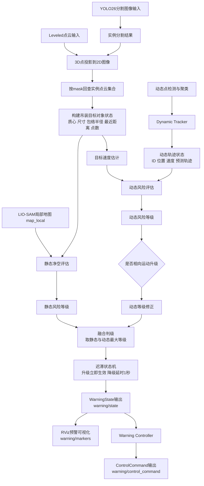
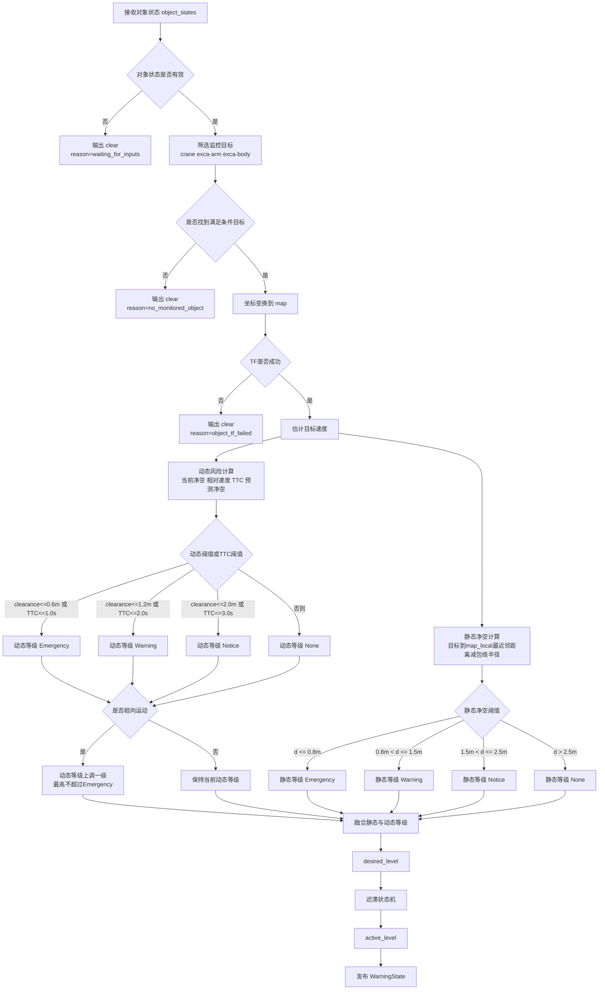
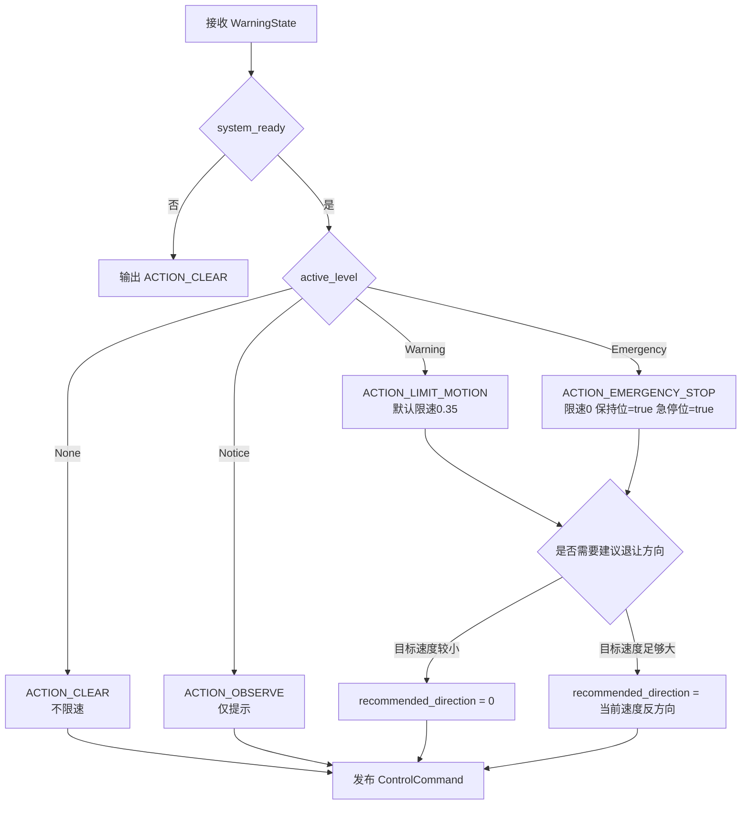

# 多层级预警机制流程图（论文/汇报版）

## 1. 总体流程图

## 2. 预警判级细化流程图

## 3. 控制接口映射流程图

## 4. 图中对应的真实代码位置

- 对象状态生成：`src/yolo26_ros/src_ros/segment.cpp`
- 动态轨迹状态：`src/LIO-SAM-MID360/src/dynamicTracker.cpp`
- 风险融合与状态机：`src/LIO-SAM-MID360/src/warningEvaluator.cpp`
- 控制命令映射：`src/LIO-SAM-MID360/src/warningController.cpp`
- 风险阈值配置：`src/LIO-SAM-MID360/config/warning_evaluator.yaml`
- 控制映射配置：`src/LIO-SAM-MID360/config/warning_controller.yaml`

## 5. 论文/汇报使用建议

### 5.1 论文正文建议用法

- 图1可作为“系统总体技术路线图”。
- 图2可作为“预警判级核心流程图”。
- 图3可作为“预警到控制接口映射流程图”。

### 5.2 口头汇报建议讲法

可按以下顺序讲：

1. 先讲感知输入不是单一图像，而是图像分割、点云和动态轨迹三路信息。
2. 再讲风险不是只看瞬时距离，而是静态净空加动态趋势联合评估。
3. 最后讲系统输出不仅有预警等级，还有控制接口原型输出。
